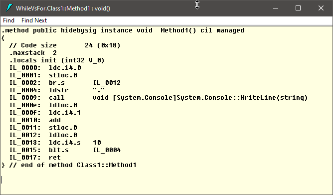

# `while` vs `for`

## Problem Description

**Loops in C#**

In C# there are multiple ways to write a loop:

- `while`
- `do-while`
- `for`
- `foreach`

In this C# Pill I want to focus on the relation between two of them: the `while` and the `for` and to answer the following question:

**Question**

- Is the `for` statement just a condensed way of writing a `while` statement?

## The initial `while`

Let's start by writing a typical `while` statement:

```csharp
int i = 0;

while (i < 10)
{
	// Do something
	
	i++;
}
```

There are three parts, well four if we take in account the code that must be executed executed repeatedly in the loop:

- The counter initialization at the beginning: `int i = 0;`
- The counter incrementation at the end: `i++;`
- The condition that decides if the next loop is executed again: `i < 10`
- The code to be executed in the loop: `// Do something`

Next, I want to demonstrate that, using a few very simple transformations, I can get from a `while` statement to a `for` statement and to highlight the similarities between them.

Having these said, let's start changing.

## Step 1: Change the "while" word to "for"

First thing we can change is the name of the instruction: the "while" word into "for".

```csharp
int i = 0;

for (;i < 10;)
{
	// Do something
	
	i++;
}
```

In order for the code to successfully compile, we also need to add two additional semicolons ";" into the `for` statement.

> **Side note**
>
> The `for` statement, in C#, contains three sub-statements that must be separated by semicolons. The three sub-statements are called by the C# runtime at precise moments:
>
> - The first sub-statement, if present, is called once, at the beginning of the `for` statement.
> - The second sub-statement, if present, must resolve to a Boolean. It is called at the beginning of each loop to decide if the `for` statement must continue or not.
> - The third sub-statement, if present, is called at the end of each loop.
>
> From the above information we understand that we can write any statement to be a sub-statement with the only condition that the second sub-statement must resolve to a Boolean.
>
> All of the sub-statements are optional, but the two semicolons are mandatory. So, the following code is a perfectly valid C# code:
>
> ```csharp
> for (;;)
> {
>     // Do something
> }
> ```
>
> Now, let's get back to our problem.

**Note**: The initial condition from the `while` statement goes as the <u>second</u> sub-statement of the `for`.

## Step 2: Include the counter's initialization

Let's include the counter's initialization (that `int i = 0;`) into the `for` statement:

```csharp
for (int i = 0; i < 10;)
{
	// Do something
	
	i++;
}
```

The counter's initialization is the <u>first</u> sub-statement of the `for`.

## Step 3: Include the counter's incrementation

Let's include the counter's incrementation (that `i++;`) into the `for` statement:

```csharp
for (int i = 0; i < 10; i++)
{
	// Do something
}
```

The counter's incrementation is the <u>third</u> sub-statement of the `for`.

## Done

Done!

We transformed the initial `while` into a `for` that does exactly the same thing.

But, does the compile generates the same IL code for both statements?

## IL Code for `while` and `for`

Let's write the following two methods; our initial `while` statement and the final `for` statement:

```csharp
public class Class1
{
    public void Method1()
    {
        int i = 0;

        while (i < 10)
        {
            Console.WriteLine(".");

            i++;
        }
    }

    public void Method2()
    {
        for (int i = 0; i < 10; i++)
        {
            Console.WriteLine(".");
        }
    }
}
```

### Decompile with ILDASM

Compile in release mode and open the dll with ILDASM:

**Method1**



**Methoid2**


**Conclusion**

Except for the name of the method, the IL code is identical.

## Final Conclusions

The `for` statement is just a syntactic sugar for the `while` statement. The generated IL code is identical.

> **Note**
>
> The `foreach` statement, even if it looks similar and has a similar name, it is significantly different than a `for`. It works very different behind the scene.

### Final Thoughts

Now, in the end, I leave you with a last question:

- How does the following `for` statement looks like if written as a `while` statement?

```csharp
for (;;)
{
	// Do something
}
```

